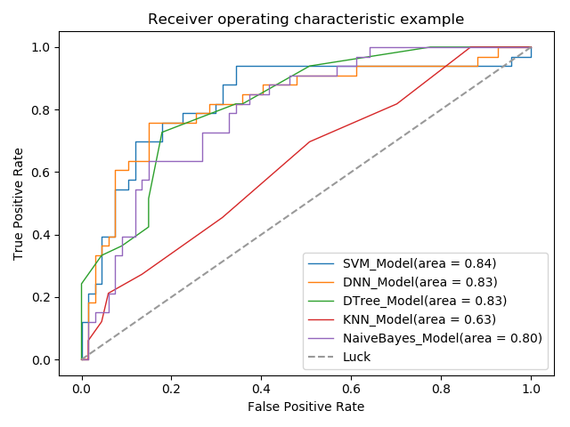
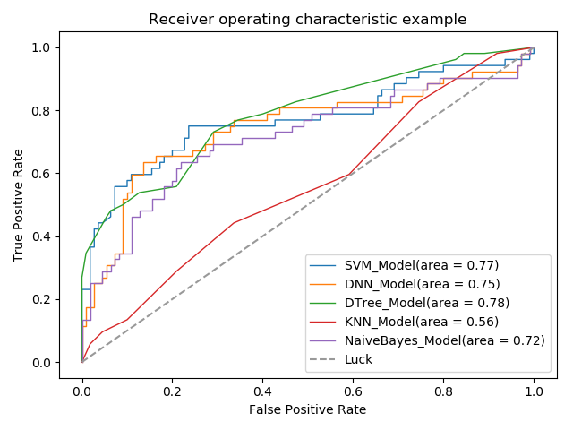

StrokePrediction Project Instructions
=======================================================
This project aims at stroke prediction using various machine learning models, including SVM, KNN, DNN,
Naive Bayes, Decision Tree.
##Structure Declaration

```
├── configs                    //config files
│   └── SVM.yaml               //a example of SVM model'config file
├── core                       //the core code
│   ├── config                
│   │   ├── default.py                  //the deafult config
│   ├── dataloader                      //the dataloder of various data format 
│   │   ├── csv_dateloader.py           //csv format data loader
│   │   ├── dataloader_builder.py       //dataloader builder builds the dataloader according to the config file
│   ├── models                 //various models 
│   │   ├── based_model.py     //the basic model of all the models
│   │   ├── dnn_model.py       //DNN model
│   │   ├── dtree_model.py     //decision tree model 
│   │   ├── knn_model.py       //knn model
│   │   ├── model_builder.py   //model builder builds the models according to the config file
│   │   ├── nbayes_model.py    //naive bayes model
│   │   ├── svm_model.py       //svm model
│   ├── utils
├── dataset                     //dataset, because of the data is not public,so you should append it yourself
│   ├── 6m3.csv                 //6 month data for the  situation after 3 mothons
│   └── readme.md
├── demo
├── pre_trained_models          //pretrained models in this folder
│   ├── DNN_Model_param.pkl     
│   ├── DTree_Model.m
│   ├── KNN_Model.m
│   ├── NaiveBayes_Model.m
│   └── SVM_Model.m
├── tools
│   ├── compare.py             //run this to compare the models pretrained 
│   ├── predict.py             //predic the result and show the roc curve of the result
│   └── train.py               //train models 
├── readme.md                  //introduction file
└── requirements.txt           //the packages you need to install for running this program
```
##Prepare
This project is based on python 3.x, and the required packages is written in requirements.txt
.You can install all of them easily by using "pip install -r requirements.txt".
And you should append the data to /dataset folder manually.

##Configuration of models and dataloader
Before you train or test this project, you should configure the model and 
dataloader. [/core/config/default.py](./core/config/default.py) is the default
config,and the the params' meaning is commented after themselves. You can modify it directly to satisfy your needs, or you can use
config files like this: `python  tools/train.py --config-file "path/to/config file/xxx.yaml"`.
Here is an example of SVM model: 
```
python  tools/train.py --config-file "../configs/SVM.yaml"
```
and `/configs/SVM.yaml` is an example of the config file. If your are using pycharm, you can 
reference [Pycharm如何配置运行参数](https://blog.csdn.net/fwj_ntu/article/details/86476275)
The parameters in config file will replace params with the same name in default.py.

##Train your model
if you modify `default.py` directly(not using config files), you can just using `python tools/train.py`
to train your model. Note that your command line's current path is in `path/to/StrokePrediction`
 , if you are using Pycharm or other IDEs, you just run `train.py`  
If you are using config files, ref `Configuration of models and dataloader`

##Test your model
Just replace the `train.py` with `predict.py`. Also, you can you default or your own config files. 
The program will build the model from the config file and load model params from the local files.

##Model comparison 
In this part, Just replace the `train.py` with `compare.py`. Also, you can you default or your own config files. 
But note that  the config file must contains all the params of 
and replace the `train.py` with `compare.py`

##Result
###1.result for 6m3.csv
  

 | Model: | ddn | decision tree | knn | naive bayes | svm |
 |-------|-------|-------|-------|-------|-------|
 | accuracy | 81.00%| 73.00% |66.00% | 76.00% | 76.00% |
 
 ###2.result for mrs12m807.csv
  
 
 | Model: | ddn | decision tree | knn | naive bayes | svm |  
 |-------|-------|-------|-------|-------|-------|
 | accuracy | 77.78% | 77.78% |67.90% | 72.22% | 79.01% |

 
 


 

